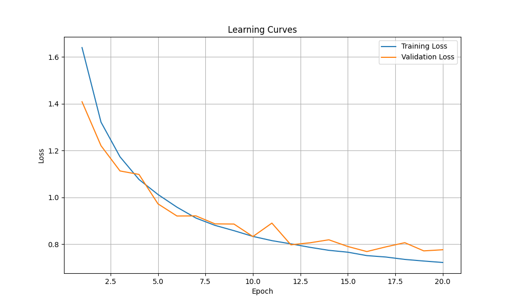
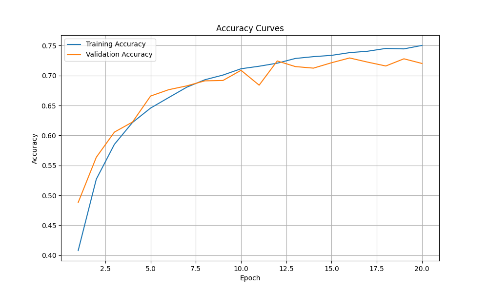
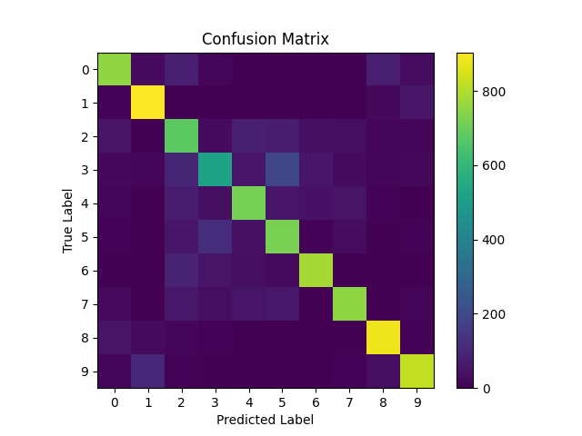
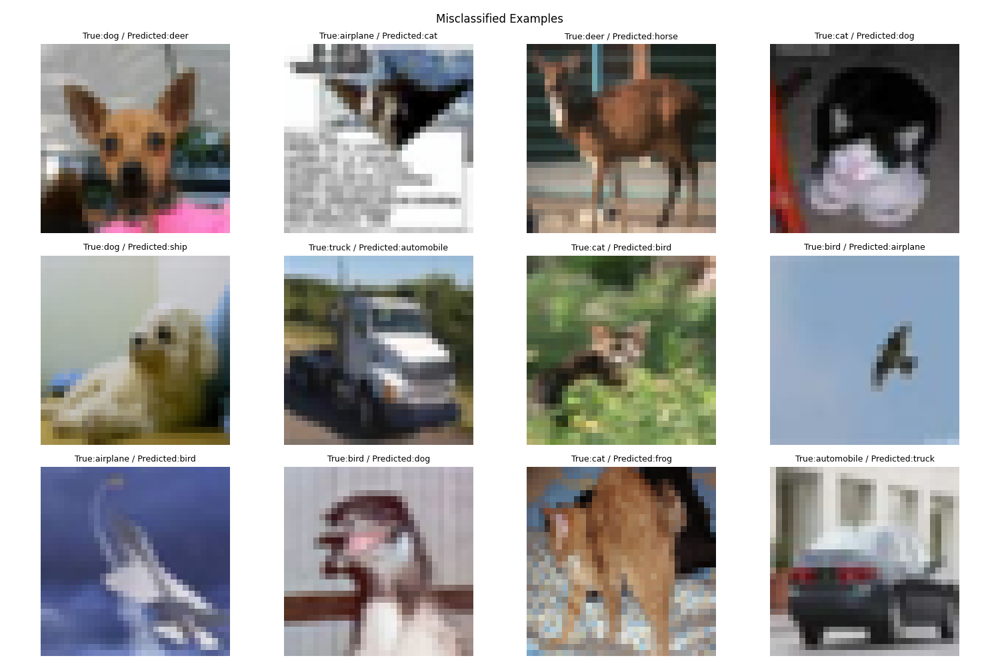
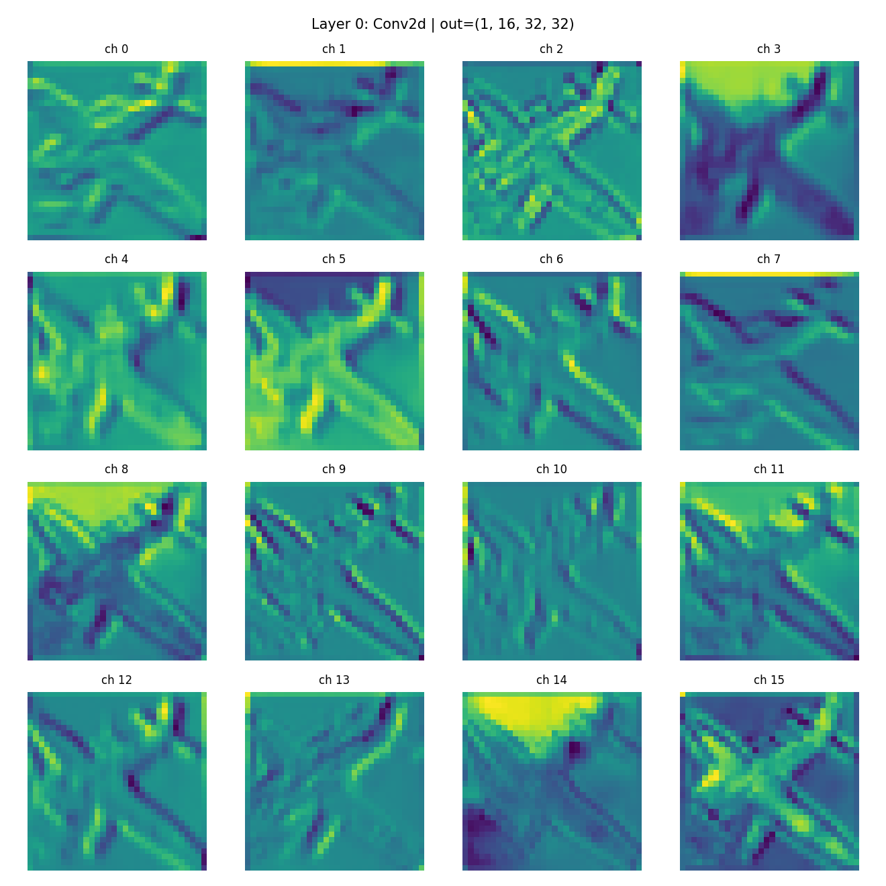
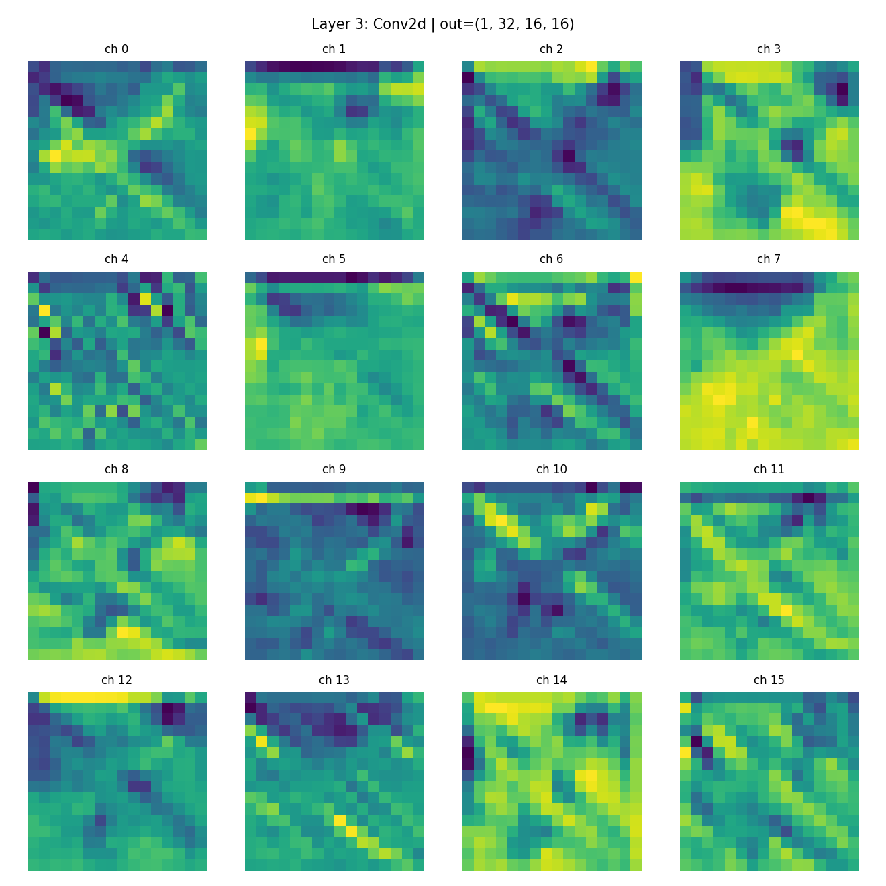
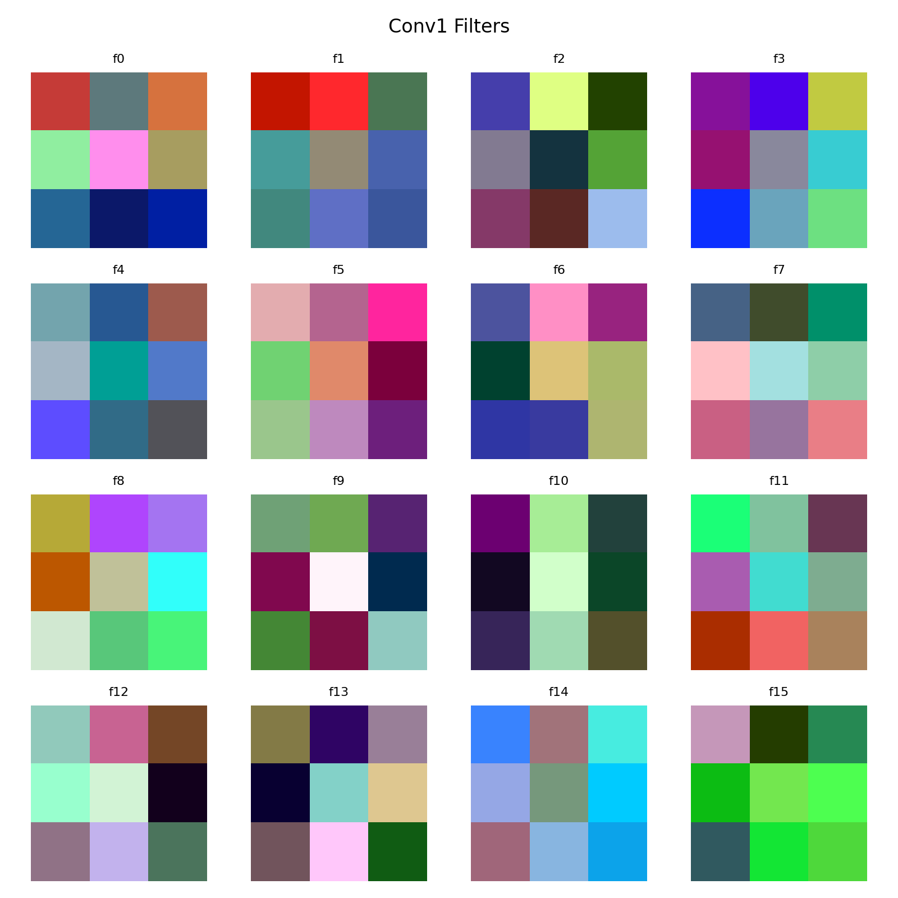
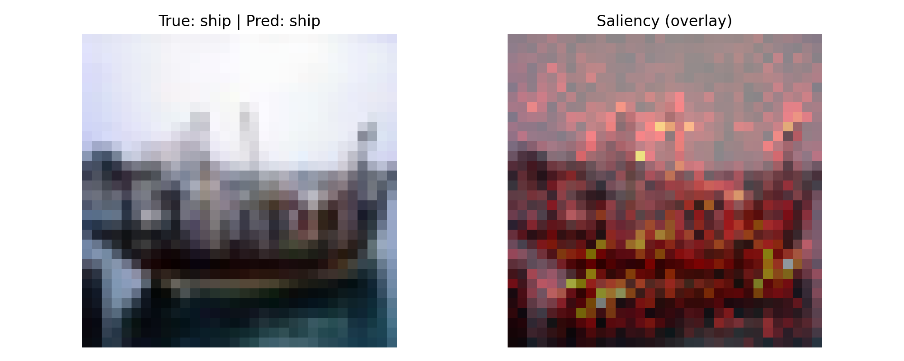

# PyTorch CNN Feature Explorer (CIFAR-10)

A **PyTorch interpretability mini-lab**: train a small CNN on **CIFAR-10**, then *open the hood* and visualize what the network learns.

This repo is intentionally focused on **feature exploration & model understanding**, not on squeezing the last % of accuracy.

---

## Highlights

- Train/val split (e.g., **45k train / 5k val**) from the CIFAR-10 training set
- Clean training loop with **best-model checkpointing** based on validation accuracy
- Metric logging to CSV for easy plotting
- Visualization suite:
  - Learning curves (loss + accuracy)
  - Confusion matrix (with **CIFAR-10 class names**)
  - Misclassified examples (with `True / Pred` labels)
  - Feature maps through the network (per-layer)
  - **Conv1 filters** (what the first layer is “looking for”)
  - **Saliency maps** (input pixels most influential for the predicted class)

---

## Quick results (baseline)

With the current CNN + transforms, the model reaches roughly:

- **Best validation accuracy:** ~**0.73** (≈ 73%)

---

## Visual Results

> These images are produced by `src/viz.py` and saved under `outputs/`.
> If you want them to render on GitHub, make sure the `outputs/` folder (or at least these images) is committed.

### 1) Learning curves

**Loss curves**



**Accuracy curves**



What to look for:
- If training loss keeps falling while validation loss rises → overfitting
- If both plateau early → underfitting or learning rate / capacity issue

---

### 2) Confusion matrix



What to look for:
- Which classes are frequently confused (e.g., **cat vs dog**, **truck vs automobile**, etc.)
- Whether errors are symmetric (A→B and B→A) or one-sided

---

### 3) Misclassified examples



What to look for:
- Are mistakes due to viewpoint/scale/occlusion?
- Are colors/backgrounds dominating the decision?
- Does the model fail on fine-grained texture vs shape?

---

### 4) Feature maps (layer-by-layer)

Feature maps show the **activations** after each layer when you pass a single image through the network.
Early layers tend to respond to edges/colors, later layers respond to larger patterns.

Example outputs are saved as:

- `outputs/featuremaps/layer_00_Conv2d.png`
- `outputs/featuremaps/layer_01_ReLU.png`
- ...

You can embed a few representative ones (optional):




---

### 5) Conv1 filters

These are the learned **weights** of the first convolution layer.
They usually resemble simple edge/color detectors.



---

### 6) Saliency map

Saliency is computed via **input gradients**:
we take the score for a target class and backprop to the input, then visualize which pixels have the strongest influence.



Notes:
- Saliency is sensitive to normalization and model confidence
- It’s an interpretability tool (not “the truth”), but it’s a solid sanity-check

---

## Project structure

A typical layout (yours may vary slightly):

```
.
├── src/
│   ├── train_val.py        # training + validation loop + checkpointing
│   ├── viz.py              # all visualization functions
│   ├── data/
│   │   └── dataset.py      # CIFAR-10 datasets + train/val/test dataloaders
	└── transforms.py   # torchvision transforms (train/test)
│   ├── models/
│   │   └── cnn.py           # CNN architecture
├── outputs/
│   ├── logs/
│   │   └── metrics.csv
│   ├── plots/
│   │   ├── loss_curves.png
│   │   ├── accuracies.png
│   │   ├── confusion_matrix.png
│   │   ├── misclassified_examples.png
│   │   ├── conv1_filters.png
│   │   └── saliency.png
│   └── featuremaps/
│       └── layer_*.png
└── models/
    └── best_cifar10_cnn.pt  # saved checkpoint
```

---

## Setup

### 1) Create environment

```bash
python -m venv venv
source venv/bin/activate
pip install -r requirements.txt
```

(If you don’t have `requirements.txt`, install the basics: `torch`, `torchvision`, `matplotlib`, `pandas`, `scikit-learn`.)

### 2) Download data

The first run will download CIFAR-10 automatically (via `torchvision.datasets.CIFAR10(download=True)`).

---

## Training

```bash
python src/train_val.py
```

Expected outputs:
- Prints epoch metrics (train loss/acc, val loss/acc)
- Saves the best checkpoint (e.g., `models/best_cifar10_cnn.pt`)
- Logs metrics to `outputs/logs/metrics.csv`

**Tip:** If you want fully reproducible runs, add a fixed random seed for:
- `torch.manual_seed`, `numpy.random.seed`
- dataloader worker seeds (if using `num_workers > 0`)

---

## Visualizations

```bash
python src/viz.py
```

This will generate plots under `outputs/plots/` and feature maps under `outputs/featuremaps/`.

---

## Implementation notes (what you’re actually doing)

### Why feature maps look “gray” sometimes

Feature maps are **not RGB images**; they are **single-channel activations** (one heatmap per channel). That’s why it’s typical to plot them with `cmap='gray'`.

### Why misclassified examples looked weird (pixelated / colors off)

If your dataset uses **Normalize(mean, std)**, then the tensors you plot are normalized. For human-friendly viewing, you need to **denormalize** before `imshow`.

### Confusion matrix class names

CIFAR-10 class order is:

```python
classes = [
  'airplane','automobile','bird','cat','deer',
  'dog','frog','horse','ship','truck'
]
```

Use these strings on your axes ticks to make the plot readable.

---

## Where to go next (if you extend this)

- Add **Grad-CAM** (more stable than raw saliency for CNN interpretability)
- Add test-time augmentation or a slightly stronger backbone (ResNet18) and compare visualizations
- Run error analysis per-class (precision/recall) and highlight the hardest confusion pairs


---

## License

MIT (or your preferred license).

---

## Acknowledgements

- CIFAR-10 dataset via `torchvision.datasets.CIFAR10`
- Core stack: PyTorch + torchvision + matplotlib
